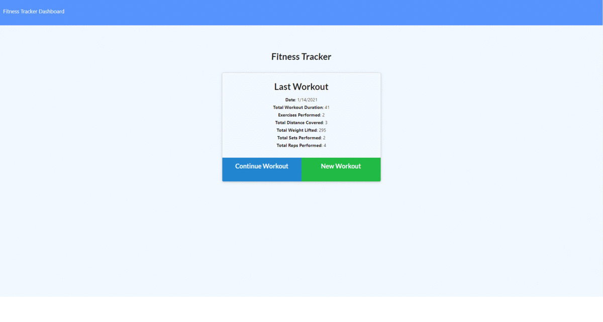

# Fitness Buddy

## Description

This is a exercise tracking app that gives the user a chart based breakdown of their workouts so they can better understand where to improve daily.

## Table of Contents

-   [Installation Instructions](#installation-instructions)
-   [Usage Information](#usage-information)
-   [License](#license)
-   [Contribution Guidelines](#contribution-guidelines)
-   [Test Instructions](#test-instructions)
-   [Questions](#questions)

## Installation Instructions

This application requires Node.js which can be downloaded <a href="https://nodejs.org/en/" target="_blank">here</a>. It utilizes the folowing node modules <a href="https://www.npmjs.com/package/mongoose" target="_blank">mongoose</a>, <a href="https://www.npmjs.com/package/dotenv" target="_blank">dotenv</a>, <a href="https://www.npmjs.com/package/express" target="_blank">express</a>, <a href="https://www.npmjs.com/package/morgan" target="_blank">morgan</a> and can be installed using <a href="https://www.npmjs.com/" target="_blank">node package manager</a>. This app utilizes a <a href="https://www.mongodb.com/1" target="_blank">mongoDB</a> database either locally or server based.

## Usage Information

The user can track their exercises in the app and it will display a breakdown of the workout information on the dashboard page in a chart fashion.

## License

This project is not utilizing a license

## Contribution Guidelines

This is a fully open source project, you may fork the repository and any pull requests will be viewed and implemented accordingly.

## Test Instructions

This application does not utilize tests

## Questions

If there are further questions please contact me with the following.

 AndrewMorrow - <a href="https://github.com/AndrewMorrow" target= "_blank">Github</a>

Email: beardedmongo@gmail.com
